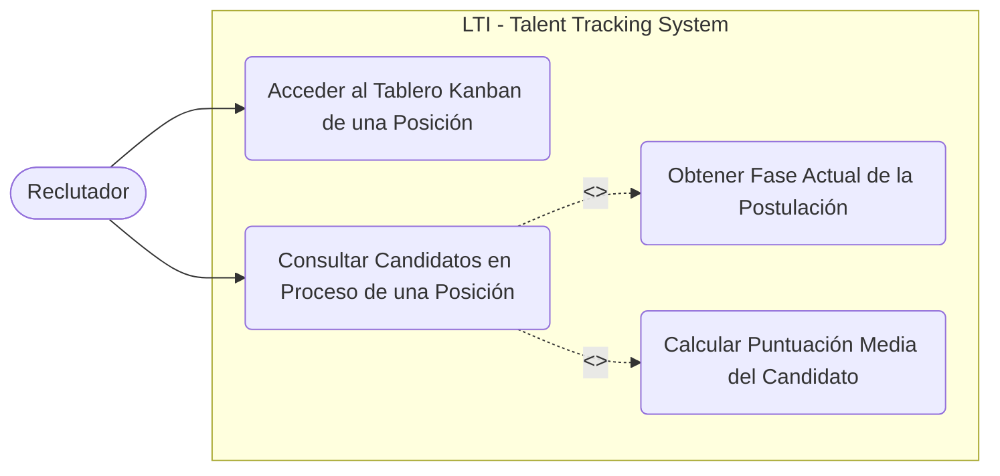
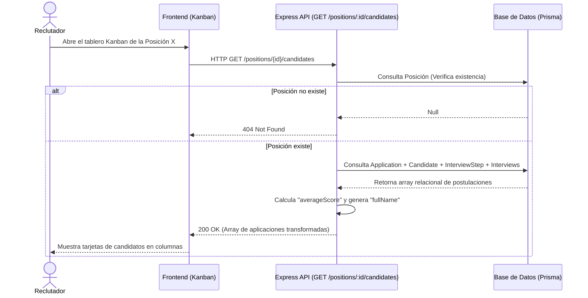

# Historia de Usuario: Obtener Candidatos por Posición (Tablero Kanban)

**ID:** US-KANBAN-01
**Épica:** Gestión del Flujo de Reclutamiento (Kanban)
**Rol:** Especialista Backend (Express + Prisma)

## 🎯 Estado de Implementación (Tareas)

> **Nota de Arquitectura:** Todos los cambios (Rutas, Controladores, Casos de Uso, Repositorios) deben realizarse obligatoriamente dentro de la carpeta `./backend/src/` respetando la arquitectura de capas actual del proyecto.

- [x] Definir interfaz de Request y Response en `./backend/src/domain/` (DTOs / Tipado).
- [x] Implementar la consulta a Base de Datos usando Prisma en la capa de infraestructura: `./backend/src/infrastructure/` (Repositorio).
- [x] Implementar la lógica de cálculo del `averageScore` e inyección del `fullName` en la capa de aplicación: `./backend/src/application/` (Servicio/Casos de Uso).
- [x] Implementar el Controlador en la capa de presentación: `./backend/src/presentation/` (Gestión de req/res y validaciones).
- [x] Añadir la configuración de la ruta `GET /positions/:id/candidates` en `./backend/src/routes/`.
- [x] Escribir pruebas en `./backend/src/tests/` (Unitarias e Integración).
  - Unit: `./backend/src/tests/positionService.test.ts`
  - Endpoint: `./backend/src/tests/positionCandidates.endpoint.test.ts`
  - Ejecutar: `cd backend && npm test`
- [x] Documentar endpoint en Swagger.
  - OpenAPI en `./backend/src/routes/positionRoutes.ts` (bloque `@openapi`)
  - Swagger spec en `./backend/src/swagger.ts`
  - UI montada en `GET /docs` (ver `./backend/src/index.ts`)

---

## 📖 Descripción (User Story)

> **Como** Reclutador / Usuario del sistema,
> **Quiero** obtener un listado de todos los candidatos que han aplicado a una vacante (posición) específica,
> **Para** poder visualizarlos en una interfaz tipo Kanban, agrupados por su fase actual en el proceso, y conocer su desempeño general (puntuación media).

---

## 🏗️ Diagrama de Casos de Uso (UML)



---

## 🔄 Diagrama de Secuencia (Flujo)



---

## ⚙️ Especificación Técnica y Diseño del Dominio (DDD)

Desde la perspectiva del **Domain-Driven Design (DDD)**, la lógica de negocio se concentra en el modelo `Application`. La base de datos establece que `Application` es la entidad puente que relaciona a un `Candidate`, una `Position`, su `currentInterviewStep` y sus evaluaciones en `Interviews`.

### ⚠️ Consideraciones de Seguridad
> **Nota:** La aplicación actual **NO cuenta con un sistema de autenticación ni autorización**. Por lo tanto, el endpoint será público. No se requiere validar tokens (ej. JWT) ni comprobar si el usuario tiene permisos o roles de "Reclutador" para visualizar esta posición.

### Reglas de Dominio:
- [x] **Identidad del Candidato:** Concatenar `Candidate.firstName` y `Candidate.lastName` para exponer el `fullName`.
  - **Implementado en**: `./backend/src/application/services/positionService.ts` (mapeo `fullName`)
  - **Cubierto por tests**: `./backend/src/tests/positionService.test.ts` y `./backend/src/tests/positionCandidates.endpoint.test.ts`
- [x] **Paso Actual:** Extraer los datos relacionales de `InterviewStep` asignado a la aplicación (al menos su `name` y `orderIndex`).
  - **Implementado en**: `./backend/src/application/services/positionService.ts` (mapeo `currentInterviewStep`)
  - **Cubierto por tests**: `./backend/src/tests/positionService.test.ts`
- [x] **Cálculo de la Puntuación Media (`averageScore`):**
  - **Implementado en**: `./backend/src/application/services/positionService.ts`
  - **Cubierto por tests**: `./backend/src/tests/positionService.test.ts` y `./backend/src/tests/positionCandidates.endpoint.test.ts`
   - Obtener todas las `Interviews` asociadas a esta `Application`.
   - Considerar sólo aquellas entrevistas que tengan un campo numérico válido `score`.
   - Retornar el promedio matemático.
   - Si no hay `score` válido (no hay entrevistas o están pendientes), devolver explícitamente `null`.

### Contrato de Respuesta de la API (Payload)
El endpoint `GET /positions/:id/candidates` retornará un arreglo:

```json
[
  {
    "applicationId": 12,
    "candidate": {
      "id": 105,
      "fullName": "Albert Saelices"
    },
    "currentInterviewStep": {
      "id": 3,
      "name": "Technical Interview",
      "orderIndex": 2
    },
    "averageScore": 8.5
  }
]
```

---

## ✅ Criterios de Aceptación (TDD / BDD)

- [x] **Escenario 1: Solicitud exitosa de candidatos en proceso (Happy Path)**
  - **Dado** que existe la posición con ID `1` y tiene múltiples aplicaciones (candidatos) en proceso.
  - **Cuando** el cliente realiza una petición `GET` a `/positions/1/candidates`
  - **Entonces** la API debe retornar un código de estado `200 OK`
  - **Y** el cuerpo de la respuesta debe ser un arreglo que cumpla estrictamente con el contrato.
  - **Cubierto por tests**: `./backend/src/tests/positionCandidates.endpoint.test.ts` (caso: `200 con promedio y fullName según contrato`)

- [x] **Escenario 2: La posición solicitada no existe en el dominio**
  - **Dado** que no existe ninguna posición con el ID `999` en la base de datos.
  - **Cuando** se realiza una petición `GET` a `/positions/999/candidates`
  - **Entonces** la API debe retornar un código de estado `404 Not Found`
  - **Y** el cuerpo debe contener un mensaje estandarizado de error de dominio (ej. `"message": "Position not found"`).
  - **Cubierto por tests**: `./backend/src/tests/positionCandidates.endpoint.test.ts` (caso: `404 si la posición no existe`)

- [x] **Escenario 3: Posición sin candidatos postulados**
  - **Dado** que la posición con ID `2` existe de manera válida pero no tiene postulaciones.
  - **Cuando** se realiza una petición `GET` a `/positions/2/candidates`
  - **Entonces** la API debe retornar un código de estado `200 OK`
  - **Y** el cuerpo de la respuesta debe ser un arreglo vacío `[]`.
  - **Cubierto por tests**: `./backend/src/tests/positionCandidates.endpoint.test.ts` (caso: `200 y [] si la posición existe pero no hay postulaciones`)

- [x] **Escenario 4: Manejo correcto del cálculo de promedio sin datos de entrevistas**
  - **Dado** que el candidato ha aplicado pero no tiene entrevistas asignadas/evaluadas.
  - **Cuando** se realiza una petición `GET` a `/positions/1/candidates`
  - **Entonces** el sistema debe devolver los datos, pero la propiedad `averageScore` debe ser explícitamente `null`.
  - **Cubierto por tests**: `./backend/src/tests/positionService.test.ts` (caso: `devuelve averageScore null si no hay scores válidos`)

- [x] **Escenario 5: Validación robusta del parámetro de entrada**
  - **Dado** que un cliente intenta inyectar texto o tipos incorrectos en la URL (`/positions/invalid/candidates`).
  - **Cuando** se realiza la petición.
  - **Entonces** la capa de presentación (middleware de validación) debe detener la petición antes de interactuar con Prisma.
  - **Y** retornar un `400 Bad Request`.
  - **Cubierto por tests**: `./backend/src/tests/positionCandidates.endpoint.test.ts` (caso: `400 si el id no es entero`)
