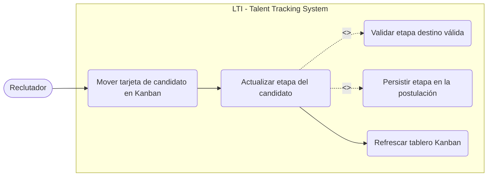
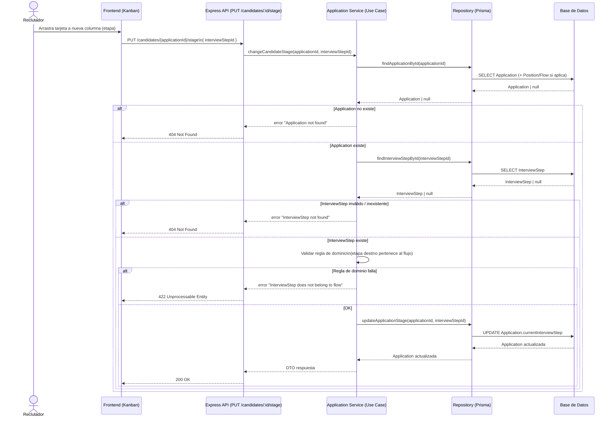

# Historia de Usuario: Mover candidato de etapa (Kanban)

**ID:** US-KANBAN-02  
**Épica:** Gestión del Flujo de Reclutamiento (Kanban)  
**Rol:** Especialista Backend (Express + Prisma)

## 🧩 Glosario (para evitar ambigüedades)

- **Candidate**: Persona (perfil) que aplica a posiciones. No tiene una “etapa” global.
- **Position**: Vacante.
- **Application**: Postulación de un `Candidate` a una `Position`. **La tarjeta del Kanban** representa una `Application`.
- **InterviewFlow / InterviewStep**: Flujo de entrevistas de la vacante y sus pasos. La columna del Kanban representa un `InterviewStep`.
- **Stage (Etapa)**: En este proyecto equivale a `Application.currentInterviewStep`.

## 🎯 Estado de Implementación (Tareas)

> **Nota de Arquitectura:** Todos los cambios (Rutas, Controladores, Servicios/Casos de Uso, Repositorios, Tests, Swagger) deben realizarse obligatoriamente dentro de la carpeta `./backend/` (principalmente en `./backend/src/`) respetando la arquitectura de capas actual del proyecto.
>
> **Nota de Dominio (importante):** En el modelo de datos, la “etapa” del candidato en un tablero Kanban corresponde al estado de su **postulación**: `Application.currentInterviewStep -> InterviewStep`.  
> En el endpoint `GET /positions/:id/candidates` ya se expone `applicationId`, por lo que en esta historia **`:id` se interpreta como `applicationId`** (la tarjeta movida en el Kanban).

- [ ] Definir contrato de request/response (DTO) en `./backend/src/domain/dtos/`.
  - [ ] `ChangeCandidateStageRequestDTO` (input) y `ChangeCandidateStageResponseDTO` (output).
  - [ ] Estándar de error payload (si el repo ya usa uno, reutilizarlo).
- [ ] Implementar repositorio en `./backend/src/infrastructure/` para:
  - [ ] Buscar `Application` por id (incluyendo `position.interviewFlow` y `currentInterviewStep`).
  - [ ] Validar existencia de `InterviewStep` destino.
  - [ ] Persistir el cambio de `currentInterviewStep`.
- [ ] Implementar caso de uso/servicio en `./backend/src/application/services/` con reglas de dominio del cambio de etapa.
  - [ ] Mapeo consistente de errores de dominio a errores HTTP (sin filtrar errores internos).
- [ ] Implementar controlador en `./backend/src/presentation/controllers/` (validación de `:id` y body, mapeo de errores).
- [ ] Añadir ruta `PUT /candidates/:id/stage` en `./backend/src/routes/` y documentarla con `@openapi`.
- [ ] Añadir/actualizar Swagger spec en `./backend/src/swagger.ts` si es necesario.
- [ ] Escribir pruebas siguiendo **TDD**:
  - [ ] Unit tests del caso de uso en `./backend/src/tests/` (sin Express).
  - [ ] Endpoint/integration tests del `PUT /candidates/:id/stage` en `./backend/src/tests/` (supertest o similar).
  - [ ] Ejecutar: `cd backend && npm test`.

---

## 📖 Descripción (User Story)

> **Como** Reclutador / Usuario del sistema,  
> **Quiero** actualizar la etapa (fase) de un candidato cuando lo muevo en el tablero Kanban,  
> **Para** reflejar de forma consistente el avance de su postulación dentro del flujo de entrevistas de una posición.

---

## 🏗️ Diagrama de Casos de Uso (UML) — Mermaid `flowchart` (NO `sequenceDiagram`)



---

## 🔄 Diagrama de Secuencia (feature)



---

## ⚙️ Especificación Técnica y Diseño del Dominio (DDD)

### Agregado y entidad central

- **Agregado/Entidad:** `Application` (Postulación).
- **Razón:** el “estado” del candidato en el Kanban está ligado a una **postulación a una posición**, no al `Candidate` de forma global.

### Invariantes / Reglas de Dominio

- **Regla 1 — Existencia:** La `Application` objetivo debe existir.
- **Regla 2 — Etapa válida:** El `InterviewStep` destino debe existir.
- **Regla 3 — Consistencia con el flujo:** El `InterviewStep` destino debe pertenecer al `InterviewFlow` de la `Position` de la `Application`.
  - Si el proyecto no modela/consulta aún el `InterviewFlow` al actualizar, este criterio exige incorporarlo en infraestructura/servicio para proteger el dominio.
- **Regla 4 — Idempotencia:** Si `currentInterviewStep` ya es el mismo `interviewStepId`, el endpoint debe responder `200 OK` sin efectos secundarios (misma representación).

### Reglas adicionales recomendadas (Kanban real)

- **Regla 5 — Transición permitida (opcional pero recomendada):** sólo permitir mover a etapas del mismo flujo y, si el negocio lo requiere, restringir “saltos” (por ejemplo, no permitir retroceder o no permitir saltar múltiples columnas).  
  - Si se implementa, la regla debe quedar explícita (p. ej. “se permite cualquier etapa del mismo flujo” vs “sólo adyacentes”).
- **Regla 6 — Orden:** `InterviewStep.orderIndex` define el orden dentro del flujo; se usa para validar transiciones si la Regla 5 se activa.

### ⚠️ Consideraciones de Seguridad

> **Nota:** La aplicación actual **NO cuenta con un sistema de autenticación ni autorización**. Por lo tanto, el endpoint es público y **no** debe requerir JWT/tokens/roles.

### Observabilidad / Operación (mínimo)

- Loggear a nivel `info` (si el proyecto ya tiene logger, usarlo) los cambios de etapa: `applicationId`, `fromInterviewStepId`, `toInterviewStepId`.
- Evitar loggear payloads completos o PII.

---

## 📌 Contrato del Endpoint

### Endpoint

- **Método/Path:** `PUT /candidates/:id/stage`
- **Semántica:** actualiza la etapa de la tarjeta movida en el Kanban.
- **Path param:**
  - `id` (**integer**) = `applicationId`

### Request Body (JSON)

```json
{
  "interviewStepId": 3
}
```

Notas:

- `interviewStepId` es **obligatorio** y debe ser entero.
- (Opcional, si el negocio lo requiere) Permitir `null` para “Sin etapa”/“Inbox” debe definirse explícitamente. Si se permite, la regla de consistencia con flujo cambia y deben actualizarse los tests.

### Response 200 (JSON)

```json
{
  "applicationId": 12,
  "currentInterviewStep": {
    "id": 3,
    "name": "Technical Interview",
    "orderIndex": 2
  }
}
```

### Ejemplos de uso (para QA / Postman / curl)

```bash
curl -X PUT http://localhost:3000/candidates/12/stage \
  -H "Content-Type: application/json" \
  -d '{"interviewStepId":3}'
```

### Errores esperados

- **400 Bad Request**
  - `:id` no es entero
  - body inválido (falta `interviewStepId`, tipo incorrecto)
- **404 Not Found**
  - `Application` no existe para el `applicationId`
  - `InterviewStep` no existe para `interviewStepId`
- **422 Unprocessable Entity**
  - el `InterviewStep` no pertenece al `InterviewFlow` de la `Position` asociada a la `Application`
- **500 Internal Server Error**
  - error inesperado

---

## 🧾 OpenAPI (bloque `@openapi` sugerido)

> Este bloque se debe incluir en la ruta correspondiente dentro de `./backend/src/routes/` (siguiendo el estilo existente en `positionRoutes.ts`).

```yaml
/**
 * @openapi
 * /candidates/{id}/stage:
 *   put:
 *     summary: Actualizar etapa de un candidato (Kanban)
 *     description: Actualiza el InterviewStep actual de una Application (tarjeta del Kanban).
 *     parameters:
 *       - in: path
 *         name: id
 *         required: true
 *         schema:
 *           type: integer
 *         description: applicationId (id de la postulación/tarjeta)
 *     requestBody:
 *       required: true
 *       content:
 *         application/json:
 *           schema:
 *             type: object
 *             required: [interviewStepId]
 *             properties:
 *               interviewStepId:
 *                 type: integer
 *     responses:
 *       200:
 *         description: Etapa actualizada
 *       400:
 *         description: Parámetros inválidos
 *       404:
 *         description: Application o InterviewStep no encontrado
 *       422:
 *         description: InterviewStep no pertenece al flujo de la Position
 *       500:
 *         description: Error interno del servidor
 */
```

---

## ✅ Criterios de Aceptación (TDD / BDD + DDD)

> **Enfoque TDD requerido:** primero tests (unit + endpoint), luego implementación mínima, luego refactor.  
> **Enfoque DDD requerido:** reglas de dominio aplicadas en el caso de uso y protegidas por tests (no sólo en controlador).

- [ ] **Escenario 1: Happy path — mover candidato a una etapa válida**

  - **Dado** que existe una `Application` con `id = 12` asociada a una `Position` con un `InterviewFlow` que contiene el `InterviewStep` `id = 3`.
  - **Cuando** se ejecuta `PUT /candidates/12/stage` con body `{ "interviewStepId": 3 }`
  - **Entonces** la API responde `200 OK`
  - **Y** persiste `Application.currentInterviewStep = 3`
  - **Y** retorna un payload con `applicationId` y `currentInterviewStep` (id, name, orderIndex).
  - **TDD (tests):**
    - Unit: verifica regla de dominio + mapeo DTO del caso de uso.
    - Endpoint: verifica status 200 y persistencia (lectura posterior o query).

- [ ] **Escenario 2: Validación del parámetro `:id`**

  - **Dado** un `:id` no entero (`/candidates/abc/stage`)
  - **Cuando** se ejecuta el request
  - **Entonces** responde `400 Bad Request`
  - **Y** no intenta interactuar con Prisma.

- [ ] **Escenario 3: Validación del body**

  - **Dado** un body sin `interviewStepId` o con tipo incorrecto
  - **Cuando** se ejecuta `PUT /candidates/12/stage`
  - **Entonces** responde `400 Bad Request`.

- [ ] **Escenario 4: Application no existe**

  - **Dado** que no existe `Application` con `id = 9999`
  - **Cuando** se ejecuta `PUT /candidates/9999/stage` con `{ "interviewStepId": 3 }`
  - **Entonces** responde `404 Not Found` con mensaje de dominio (ej. `"message": "Application not found"`).

- [ ] **Escenario 5: InterviewStep no existe**

  - **Dado** que la `Application` existe
  - **Y** no existe `InterviewStep` con `id = 999`
  - **Cuando** se ejecuta `PUT /candidates/12/stage` con `{ "interviewStepId": 999 }`
  - **Entonces** responde `404 Not Found` con mensaje de dominio (ej. `"message": "InterviewStep not found"`).

- [ ] **Escenario 6: Regla DDD — InterviewStep no pertenece al flujo de la posición**

  - **Dado** que existe `Application id = 12`
  - **Y** existe `InterviewStep id = 7`
  - **Pero** el `InterviewStep 7` pertenece a otro `InterviewFlow` distinto al de la `Position` asociada a la `Application`
  - **Cuando** se ejecuta `PUT /candidates/12/stage` con `{ "interviewStepId": 7 }`
  - **Entonces** responde `422 Unprocessable Entity`
  - **Y** no persiste cambios en `currentInterviewStep`.

- [ ] **Escenario 7: Idempotencia**
  - **Dado** que la `Application 12` ya tiene `currentInterviewStep = 3`
  - **Cuando** se ejecuta `PUT /candidates/12/stage` con `{ "interviewStepId": 3 }`
  - **Entonces** responde `200 OK`
  - **Y** la respuesta representa el mismo estado (sin duplicar efectos secundarios).

- [ ] **Escenario 8: Robustez ante múltiples movimientos rápidos (consistencia)**
  - **Dado** que el frontend puede disparar dos movimientos consecutivos en milisegundos (drag-and-drop rápido)
  - **Cuando** llegan dos `PUT /candidates/12/stage` concurrentes
  - **Entonces** la base de datos debe quedar en el último estado persistido
  - **Y** el sistema no debe quedar en un estado inválido (por ejemplo, una etapa que no pertenece al flujo).
  - Nota: si se requiere control de concurrencia fuerte, documentar estrategia (transacción o validación en update).

---

## 📎 Referencias del modelo de datos

- La etapa se almacena en `Application.currentInterviewStep` y referencia a `InterviewStep`.
- `InterviewStep` pertenece a `InterviewFlow`, y `Position` usa `InterviewFlow`.
- Ver: `@docs/database/database_model.md`
