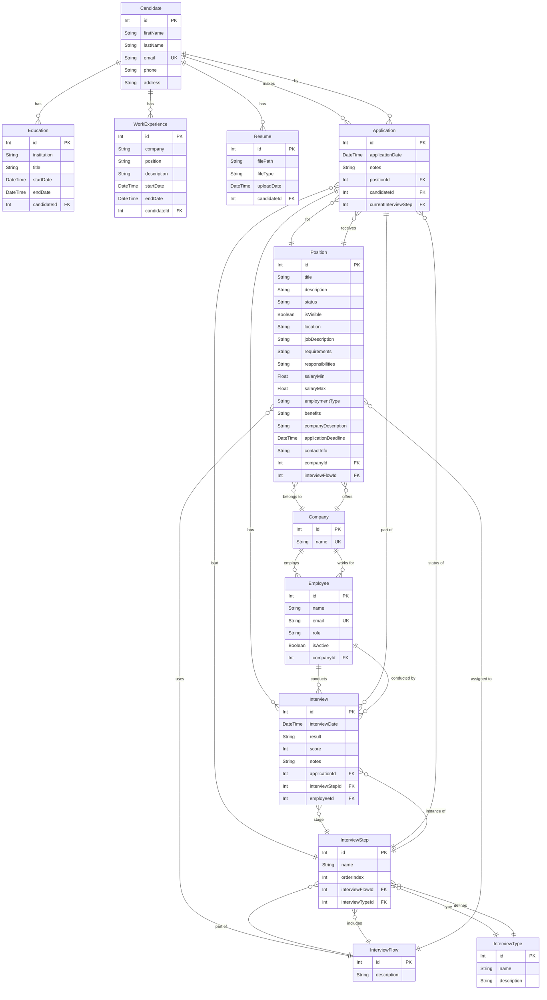

# Documentación del Modelo de Datos

Esta documentación describe la estructura de la base de datos para el Sistema de Seguimiento de Talento (LTI), generada a partir del esquema de Prisma.

## Diagrama Entidad-Relación (ER)

## Diccionario de Datos

El sistema se compone de los siguientes modelos principales agrupados en tres dominios clave: Candidatos, Empresas y el Flujo de Reclutamiento.

### 1. Dominio de Candidatos

#### `Candidate` (Candidato)
Representa a un aplicante o postulante en el sistema.
- **Campos:**
  - `id`: Identificador único autoincremental (PK).
  - `firstName` / `lastName`: Nombres y apellidos.
  - `email`: Correo electrónico (debe ser único).
  - `phone` / `address`: Información de contacto opcional.
- **Relaciones:**
  - `educations`: Un candidato puede tener múltiple historial educativo (1:N).
  - `workExperiences`: Un candidato puede tener múltiples experiencias de trabajo (1:N).
  - `resumes`: Un candidato puede haber subido múltiples currículums (1:N).
  - `applications`: Un candidato puede aplicar a múltiples posiciones (1:N).

#### `Education` (Educación)
Registra el historial de educación de un candidato.
- **Campos Clave:** `institution`, `title`, `startDate`, `endDate`.
- **Relaciones:** Pertenece a un único candidato (`candidateId`).

#### `WorkExperience` (Experiencia Laboral)
Registra los trabajos anteriores del candidato.
- **Campos Clave:** `company`, `position`, `description`, `startDate`, `endDate`.
- **Relaciones:** Pertenece a un único candidato (`candidateId`).

#### `Resume` (Currículum)
Maneja los archivos adjuntos subidos por el candidato.
- **Campos Clave:** `filePath` (ruta en el servidor o S3), `fileType`, `uploadDate`.
- **Relaciones:** Pertenece a un único candidato (`candidateId`).

---

### 2. Dominio de Empresas (Company)

#### `Company` (Empresa)
Entidad que representa a la organización o empleador.
- **Campos:** `id` (PK), `name` (Único).
- **Relaciones:** Tiene múltiples empleados (1:N) y posiciones (1:N).

#### `Employee` (Empleado)
Usuario o trabajador de una empresa (usualmente reclutadores o entrevistadores).
- **Campos Clave:** `name`, `email` (único), `role`, `isActive`.
- **Relaciones:** Pertenece a una empresa (`companyId`) y puede llevar a cabo múltiples entrevistas (`interviews`).

#### `Position` (Posición / Vacante)
Vacante laboral ofrecida por una empresa.
- **Campos Clave:** `title`, `description`, `status` (ej. Draft), `salaryMin` / `salaryMax`, `employmentType`, `applicationDeadline`.
- **Relaciones:** Pertenece a una empresa (`companyId`) y está ligada a un flujo de entrevistas (`interviewFlowId`). Puede recibir múltiples aplicaciones (`applications`).

---

### 3. Dominio de Reclutamiento (Flujo y Entrevistas)

#### `InterviewFlow` (Flujo de Entrevista)
Define la serie de pasos o etapas para el proceso de contratación.
- **Campos:** `id` (PK), `description`.
- **Relaciones:** Está asociado a múltiples posiciones y contiene múltiples pasos (`InterviewStep`).

#### `InterviewType` (Tipo de Entrevista)
Catálogo para clasificar las entrevistas (ej. RRHH, Técnica, Fit Cultural).
- **Campos:** `id` (PK), `name`, `description`.

#### `InterviewStep` (Paso de Entrevista)
Representa una etapa individual dentro del proceso general del flujo.
- **Campos Clave:** `name`, `orderIndex` (Define la secuencia del paso).
- **Relaciones:** Pertenece a un flujo (`interviewFlowId`) y es de un tipo determinado (`interviewTypeId`). Sirve como estado actual de las aplicaciones.

#### `Application` (Aplicación)
La postulación formal de un candidato a una posición específica.
- **Campos Clave:** `applicationDate`, `notes`.
- **Relaciones:** Conecta a un candidato (`candidateId`) con una posición (`positionId`). Controla el estado del proceso en base al paso en el que se encuentra (`currentInterviewStep`).

#### `Interview` (Entrevista)
El registro de un evento de entrevista particular programado y evaluado.
- **Campos Clave:** `interviewDate`, `result`, `score`, `notes`.
- **Relaciones:** 
  - Realizada como parte de una postulación (`applicationId`).
  - Corresponde a una etapa particular del flujo (`interviewStepId`).
  - Llevada a cabo por un empleado o reclutador de la empresa (`employeeId`).
